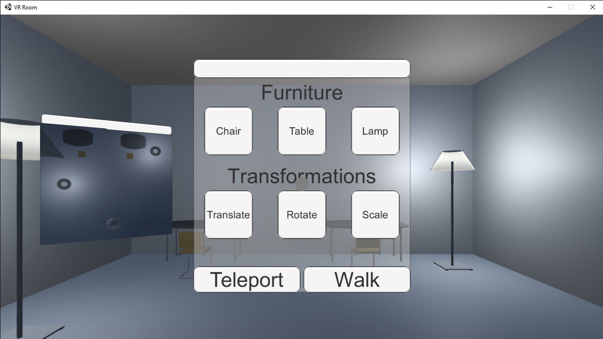

# VR Room
## Development of an Interactive Virtual Room

Tools Used - Unity, GoogleVR

### Overview
This personal project was built in order to experience control in a virtual environment. The viewer is able to move around the room in different ways, create objects from the thin air and transform them as desired. There is also a mini-map to help keep track of position.

### Features
- **Room**: The room is a simple four-walled spaced with a floor and a roof.
- **Furniture**: The basic furniture present in the room are chairs, tables and lamps.
- **Mini-map**: The mini-map position is referenced from the player's gaze direction.
- **Menu**: The player can interact dynamically with the virtual environment through the menu options.

### Menu Actions
-  **Furniture**: Click any of the three buttons in this section to create the corresponding furniture.
- **Transform**: Move, rotate and scale the furniture in the room with the corresponding buttons.
- **Move**: The player can move around the room in two modes; teleport or walk.

---
This is a guided project from the EDx course - [Creating Virtual Reality (VR) Apps](https://www.edx.org/course/creating-virtual-reality-vr-apps-2)